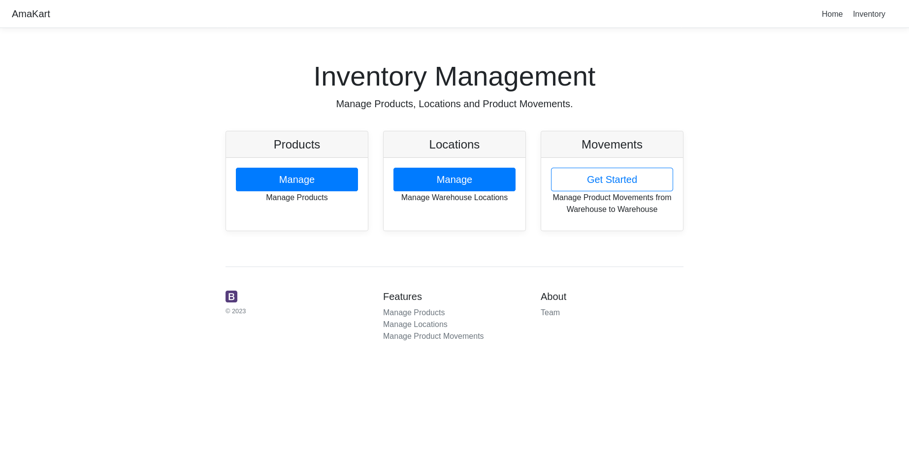
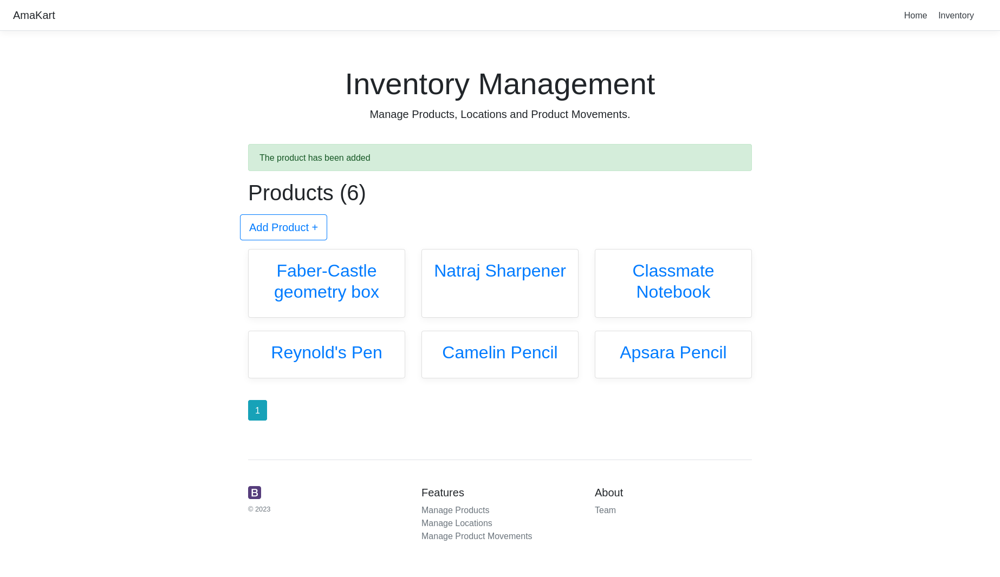
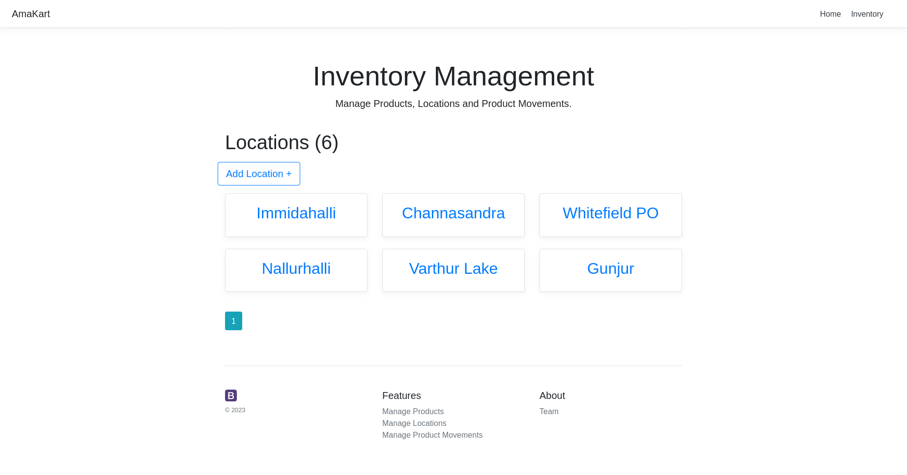
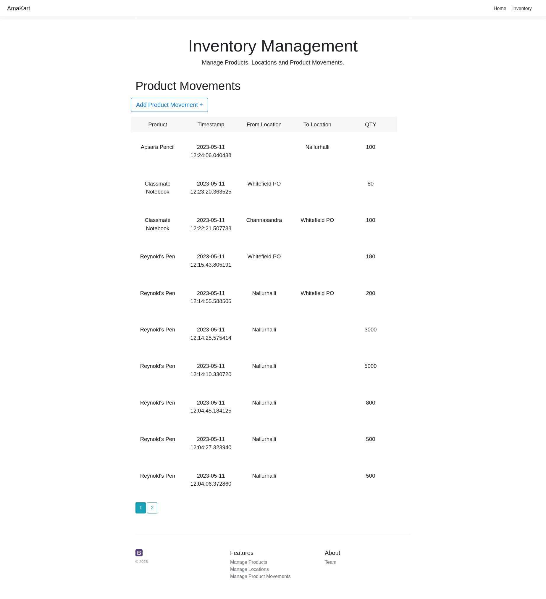
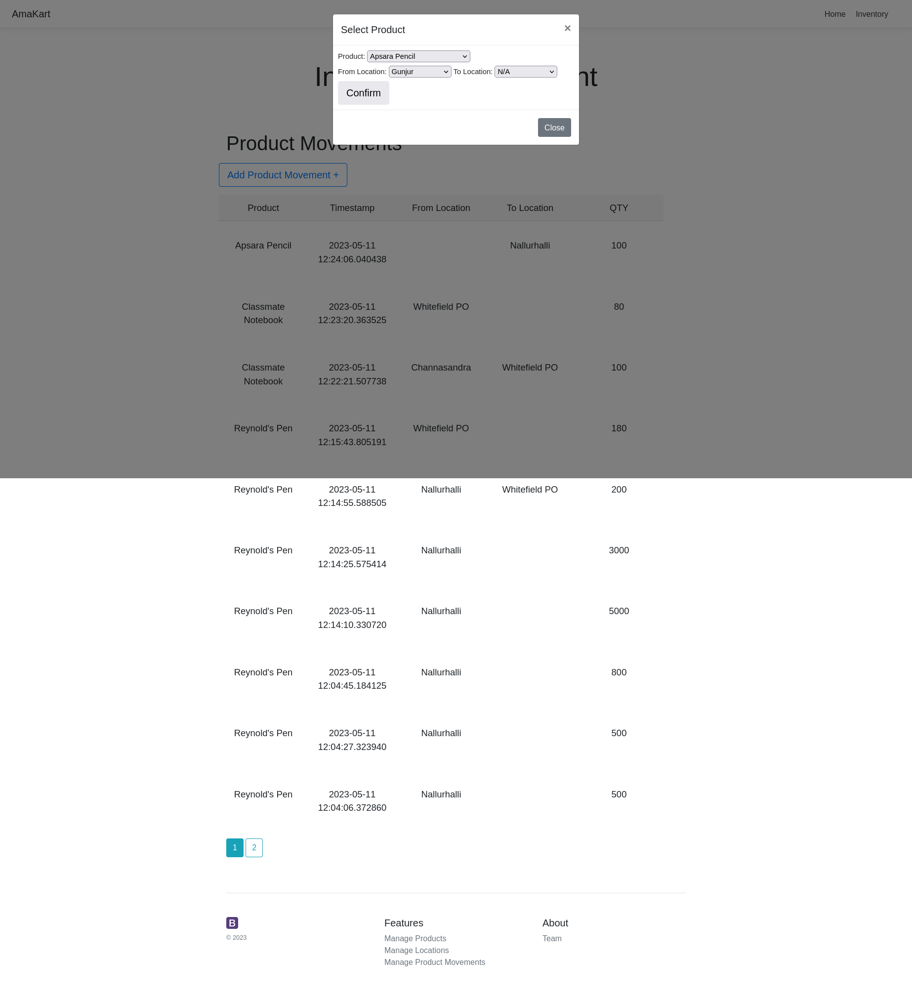
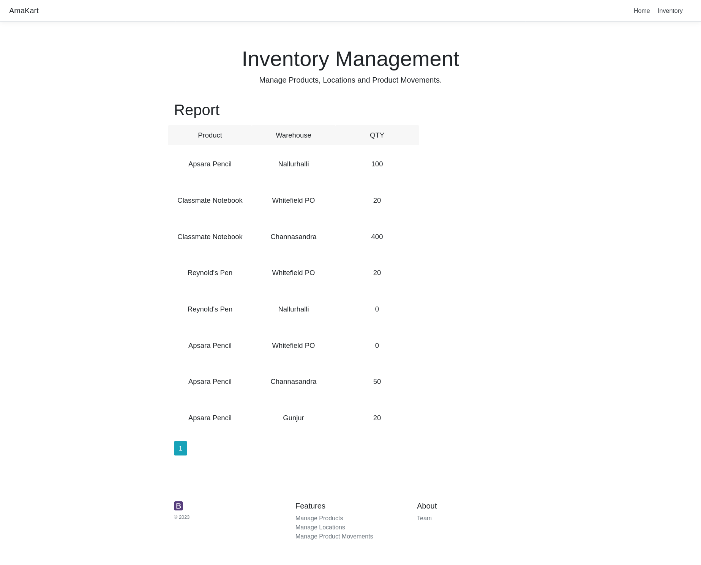

# Inventory Management App
A web application built using Flask framework to manage an inventory of products at their respective warehouses.
## Screenshots
### Home Page

### Products Page

### Locations Page

### Product Movement Page


### Report Page

## System Requirements
 - ### OS - Linux
 - ### CPU - 2
 - ### RAM - 4 GB
## Execution steps
1. ### From amakart/ dir create venv and activate
```bash
python -m venv venv
source venv/bin/activate
```
2. ### Install the dependencies using the requirements.txt file
```bash
pip3 install -r requirements.txt
```
3. ### Finally spin-up the Flask app server using the following command
```bash
python app.py
```
4. ### Access the web application via clicking here
[Flask App](http:127.0.0.1:5000/)